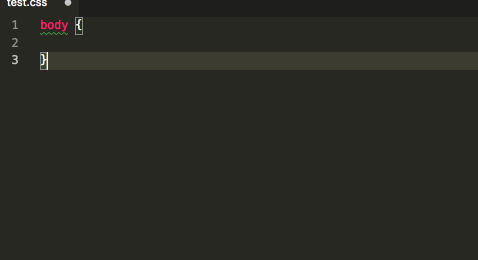

 

## px2vw

一个 px 单位转成 vw 单位的 VSCode 插件




## 安装

1. 通过命令行安装

    ```shell
    ext install px2vw
    ```

2. 直接在 vscode 编辑上插件上查找安装 `px2vw`

3. [下载 vsix](https://marketplace.visualstudio.com/items?itemName=px2vw.px2vw) 

    > 打开vscode，拓展，点击三个小点，“从VSIX安装”，即可。成功后重启软件。


## 使用

- 自动提示
- `cmd + shift + p` 调出命令行全局替换 (mac 快捷键)

## 支持语言

- html
- css
- less
- sass
- scss
- stylus

## 配置

根据设计稿宽度设置大小，默认：750，之后就可以直接按设计稿大小编写。

- `px2vw.width` 设计宽度
- `px2vw.toFixedNum` 保留小数


